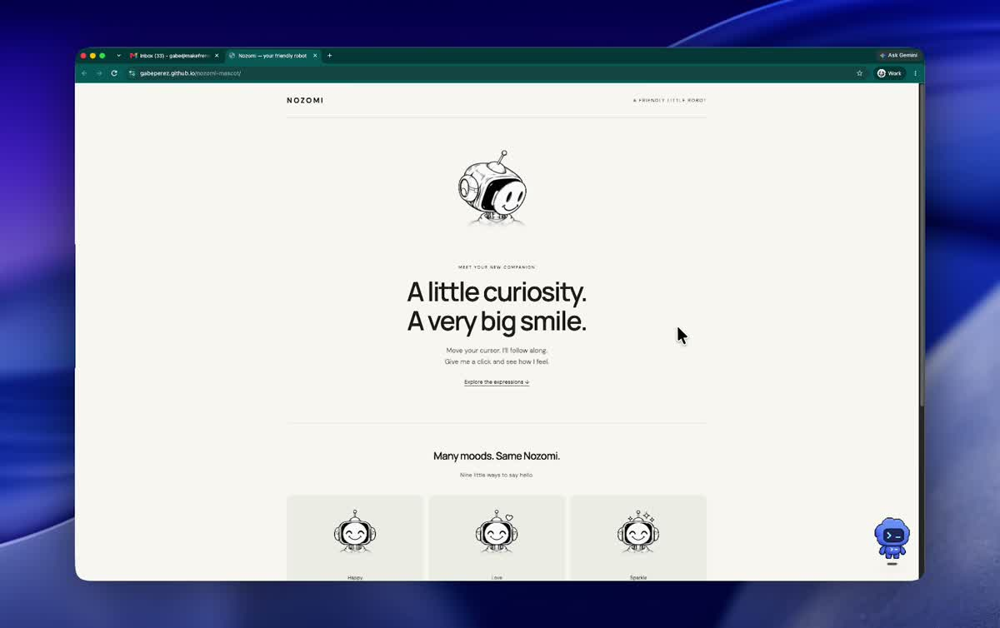

# Nozomi mascot

[Live demo](https://gabeperez.github.io/nozomi-mascot/) · [Repository](https://github.com/gabeperez/nozomi-mascot)

Interactive mascot based on the supplied robot drawing, using [page-mascot](https://koboyo.com/page-mascot).

## Video demo

[Watch the video demo](https://gabeperez.github.io/nozomi-mascot/demo/nozomi-mascot.mp4) · [Try the interactive demo](https://gabeperez.github.io/nozomi-mascot/)

## Run locally

Run `bun install` then `bun run dev`. Production build: `bun run build`.

- `public/mascots/`: aligned WebP atlases ready for React.
- `characters/nozomi/`: original generated transparent PNG sheets, retained for rebuilding.
- `src.tsx`: working React integration and expression gallery.
- `prompts.json`: generation prompts; built-in image generation was used.

Checks: true RGBA transparency; skill verifier reports 0.00 px vertical click shift at 140px, 89.5% overlap, 95.6% palette match, 8.5% width variation. Generated art retains minor outline/width variation. Browser checks cover cursor response, click reaction and mobile overflow.

## Deployment

GitHub Actions builds and deploys the demo to GitHub Pages on every push to `main`. Relative asset paths support the repository subdirectory.

## Consumer test studio

[Open the studio](https://gabeperez.github.io/nozomi-mascot/test/).
Connect a Sui wallet, get free test SUI using the in-app faucet link, and claim a practice character. Pick a name and backdrop, then save it for **0.01 test SUI plus gas**. Download an animated GIF, a ZIP with sprites/CSS/JavaScript, or copy a hosted iframe embed. The wallet must hold the character to resume its downloads in the app.

This is a real testnet mint and unlock flow using our own `TestCharacter` collection. It does **not** mint or modify Prime Machin NFTs, verify Prime Machin ownership, or generate fresh AI artwork. The artwork is the shared Nozomi sample. Public static assets are not access-controlled; the payment demonstrates an on-chain unlock, not DRM. Testnet data may reset. Wallet connection and wallet approval are still required; email sign-in and sponsored gas are not implemented.

The studio contract records name, backdrop, and unlock on the character itself; transferring it preserves those fields. Claims are limited to one per address. Names/backdrops are immutable after unlock. The fixed test payment goes to the dedicated development wallet. There is no production pricing or mainnet payment path.

- Contract: `contracts/nozomi-studio/sources/studio.move`
- Deployment and successful live claim/unlock receipts: `deployments/studio-testnet.json`
- Tests: `sui move test --path contracts/nozomi-studio --build-env testnet`
- Development smoke test: `bun scripts/test-studio.ts` (requires the separately stored local test wallet; never put a private key in this repository)
- Frontend validation: `bun run typecheck && bun run build`

The previous generic `nozomi-unlock` package remains a separate prototype for future original-NFT ownership integration.

## Native passkeys and Walrus homes (September 16 update)

The default `/test/` flow now uses a **passkey**: create an account with the device's biometric/screen-lock UI, choose name/backdrop, and click **Confirm**. An upgraded `create` function mints and personalizes atomically. The user signs with their passkey; a separate Cloudflare test sponsor pays the fixed contribution and gas. No Slush extension or test faucet is required for this path. Biometric prompts remain intentional. Google/email sign-in is not configured.

Existing Slush characters remain accessible at [`/test/?wallet=1`](https://gabeperez.github.io/nozomi-mascot/test/?wallet=1). Passkeys create a different Sui address and do not control NFTs in an existing wallet. Only public-key/credential metadata is cached locally; private passkey material remains with the authenticator. The relying-party domain is `gabeperez.github.io`, so a future custom domain needs an explicit migration. Recovering on a fresh browser may require two passkey assertions to recover the Sui public key.

### Homes

[Visit Nori's Walrus-backed home](https://nozomi-homes.perez-jg22.workers.dev/?id=0x6ffe50ae1aa9e0a9022fed69de892de97e0cd6050fe4efa8a6716d1fa08d249a).

- Every character has its own public URL (`?id=<Sui character ID>`), read directly from Sui with exact type and studio checks.
- The HTML, JavaScript, styles, and sprite artwork are published as a **shared Walrus Site** on testnet. This is one shared home renderer, not a separate Walrus Site object per character.
- Site object: `0xa415bafe75abd3ed12890419554ca8c036615b2c2e6650bf41f5d0772025d567`. Site ownership is held by the development wallet, independently from users' character ownership.
- `worker/home-portal.ts` serves the pinned Walrus quilt patches through a read-only HTTPS portal and checks SHA-256 before serving. The Worker does not embed copies of the artwork or HTML. Deployment pointers and hashes are in `deployments/walrus-home-testnet.json`.
- GitHub Pages `/home/?id=...` remains a mirror. The regular wallet demo embed still uses GitHub Pages.
- The home can be updated while retaining the same site object and character URLs. Run `bun scripts/publish-home.ts` with the separately installed CLI tools and local test wallet; it rebuilds, updates Walrus for 30 epochs, verifies the manifest, and deploys the portal.
- Storage was purchased for **30 testnet epochs**, not forever. Renewal is manual; no recurring job is enabled. Testnet resets and network outages can affect availability. The public `wal.app` portal serves mainnet, hence our separate testnet portal.
- Say hello/night mode are transient interactions. Future Tamagotchi features need persistent owner-authorized state, timestamps/cooldowns, and a versioned game renderer; they are not implemented yet.

### Sponsor limits and operations

The dedicated sponsor key is stored separately from the site/upgrade wallet and supplied to Cloudflare as an encrypted Worker secret. It is never bundled in the frontend or committed. `worker/index.ts` builds only the exact allowlisted testnet `create` transaction, verifies the sender's passkey signature, then adds the sponsor signature. It accepts no arbitrary client-supplied transaction bytes.

Limits: one successful sponsorship per sender, 10 signing attempts/day globally, 30 overall, 20 preparation attempts/IP/day, a 0.015 SUI gas budget, and a 0.01 test SUI contribution per attempt. Its initial balance is 0.25 test SUI. Concurrent stale coin versions may require retrying; the failed attempt still consumes the safety budget. Origin checks are not treated as authentication. Real ownership comes from signature verification and the contract.

The live flow was tested with Chromium's virtual WebAuthn authenticator against real Sui testnet, including sponsored mint/personalization and reading the resulting NFT on its Walrus home. Physical Face ID/Touch ID hardware has not been exercised by automation. Seven Move tests and source verification passed. The previous six-test studio deployment remains valid; see the v2 deployment receipt for the added atomic create function.
